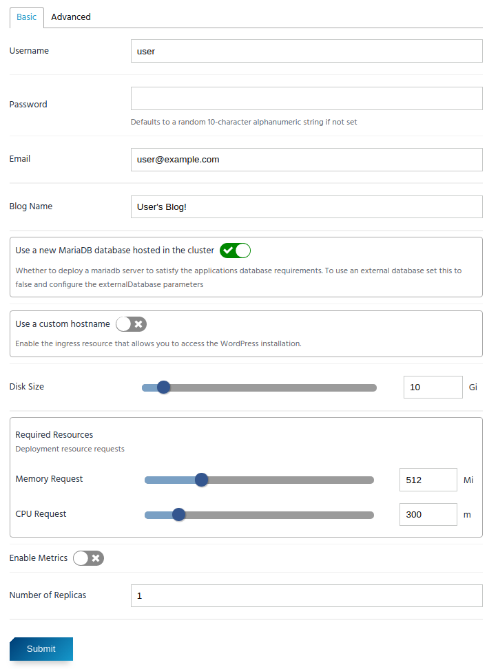

# Basic Form Support

**NOTE:** This feature is under heavy development. Some of the described below may change in the future.

Since Kubeapps 1.6.0, it's possible to include a JSON schema with a chart that defines the structure of the `values.yaml` file. This JSON schema is used with two goals:

 - Validate that the given values satisfy the schema defined. In case the submitted values are not valid, the installation or upgrade will fail. This has been introduced with Helm v3.
 - Present the user with a simpler so the chart is easier to deploy and configure.

The goal of this feature is to present the user with the most common parameters which are typically modified before deploying a chart (like username and password) in a more user-friendly form.

This document specifies what's needed to be defined in order to present this basic form to the users of a chart.

## Create a values.schema.json

This file, introduced with Helm v3, is a [JSON Schema](https://json-schema.org/) that defines the structure of the `values.yaml` file of the chart, including as many validations as needed. If a chart includes its schema, the values used are validated before submitting the new release.

This file can define some or every possible value of the chart. Once it's written it should be included in the Helm package. The proposal to include it in Helm can be found [here](https://github.com/helm/helm/issues/5812).

## Additional annotations used to identify basic parameters

In order to identify which values should be presented in the form, it's necessary to include some special tags.

First of all, it's necessary to specify the tag `form` and set it to `true`. All the properties marked with this tag in the schema will be represented in the form. For example:

```json
    "wordpressUsername": {
      "type": "string",
      "form": true
    },
```

With the definition above, we are marking the value `wordpressUsername` as a value to be represented in the form. Note that the `type` tag, apart than for validating that the submitted value has the correct type, will be used to render the proper HTML components to represent the input in the form:


In addition to the `type`, there are other tags that can be used to customize the way the parameter is represented:

 - `title` is used to render the title of the parameter. If it's not specified, Kubeapps will use the path of the value (i.e. `credentials.username`).
 - `description` is used to include additional information of the parameter.
 - `default` is used to set a default value. Note that this field will only be used if the `values.yaml` file doesn't have already a default value for the parameter.

### Custom type: Slider

It's possible to render a component as a slider, users can then drag and drop this slider to select their preferred value:


In order to render a slider, there are some requirements and additional tags that you may need to set:

 - The only supported `type` for the moment is a string. Other types like `integer` will be transformed to a string.
 - It's necessary to specify the tag `render` and set it to `slider`.
 - The tag `sliderMin` identifies the minimum value the slider allows (this can be bypassed writting a smaller value in the input).
 - The tag `sliderMax` identifies the maximum value the slider allows (this can be bypassed writting a bigger value in the input).
 - The tag `sliderUnit` specifies the unit of the value to set. For example `Gi`.

 This is an example of a slider param:

```json
    "size": {
      "type": "string",
      "title": "Disk Size",
      "form": true,
      "render": "slider",
      "sliderMin": 1,
      "sliderMax": 100,
      "sliderUnit": "Gi"
    }
```

### Custom type: TextArea

It's possible to render a component as a textArea instead of a single-line string.

In order to render a component as a textArea, it's necessary to specify the tag `render` and set it to `textArea`.

 This is an example of a textArea param:

```json
    "size": {
      "type": "string",
      "title": "Configuration",
      "description": "Configuration to be used",
      "form": true,
      "render": "textArea"
    }
```

### Subsections

When a property of type `object` is set with a `form` identifier, it will be rendered as a subsection. A subsection is a set of parameters that are grouped together:


All the parameters within an `object` will be rendered in the subsection.

Note that in some cases, a parameter cause that the rest of parameters are no longer relevant. For example, setting `ingress.enabled` to `false` makes the `ingress.hostname` irrelevant. To avoid confussion, you can hide that parameter setting the special tag `hidden`. The tag `hidden` can be a `string` pointing to the parameter that needs to be `true` to hide the element or an object to also set the value that the pointed value needs to match.

This is an example for a subsection with a parameter that can be hidden:

```json
    "ingress": {
      "type": "object",
      "form": "ingress",
      "title": "Ingress Details",
      "properties": {
        "enabled": {
          "type": "boolean",
          "form": "enableIngress",
          "title": "Use a custom hostname",
          "description": "Enable the ingress resource that allows you to access the WordPress installation."
        },
        "hostname": {
          "type": "string",
          "form": "hostname",
          "title": "Hostname",
          "hidden": {
            "value": "ingress.enabled",
            "condition": false
          }
        }
      }
    },
```

Note that the parameter that hides another parameter doesn't need to be within the section itself. In this other example, `mariadb.enabled` is used to hide some parameters within `externalDatabase`:

```json
    "mariadb": {
      "type": "object",
      "properties": {
        "enabled": {
          "type": "boolean",
          "title": "Use a new MariaDB database hosted in the cluster",
          "form": "useSelfHostedDatabase",
        }
      }
    },
    "externalDatabase": {
      "type": "object",
      "title": "External Database Details",
      "form": "externalDatabase",
      "properties": {
        "host": {
          "type": "string",
          "form": "externalDatabaseHost",
          "title": "Database Host",
          "hidden": "mariadb.enabled"
        },
      }
    },
```

## Example

This is a [working example for the WordPress chart](https://github.com/helm/charts/blob/master/stable/wordpress/values.schema.json)

And the resulting form:


