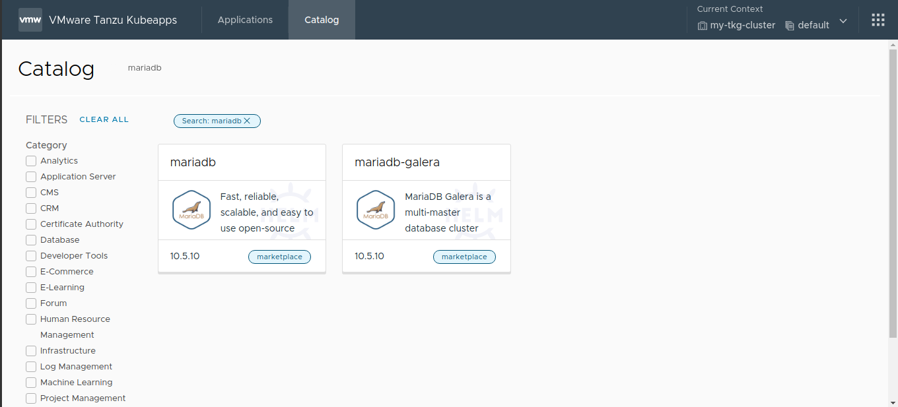
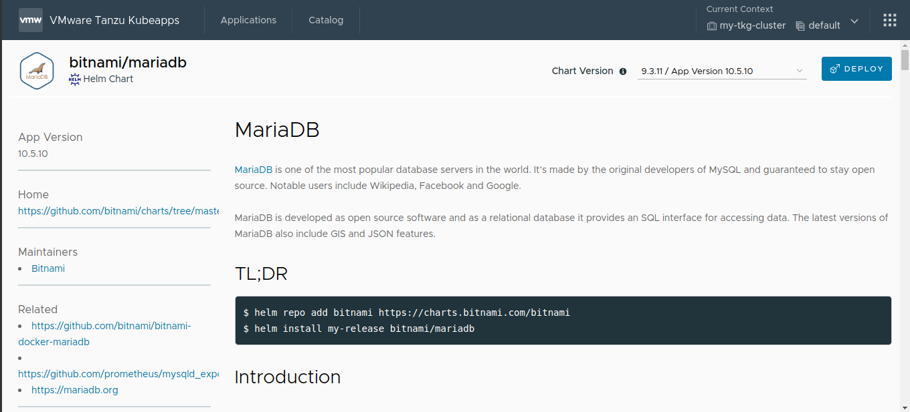
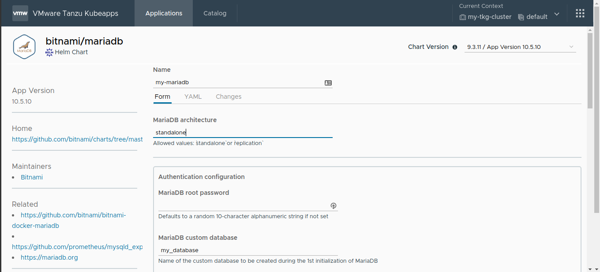
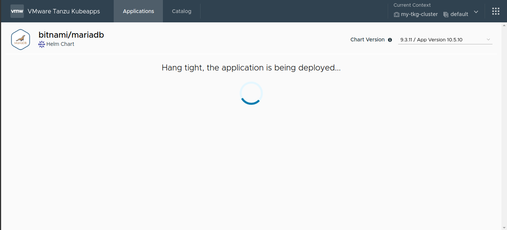
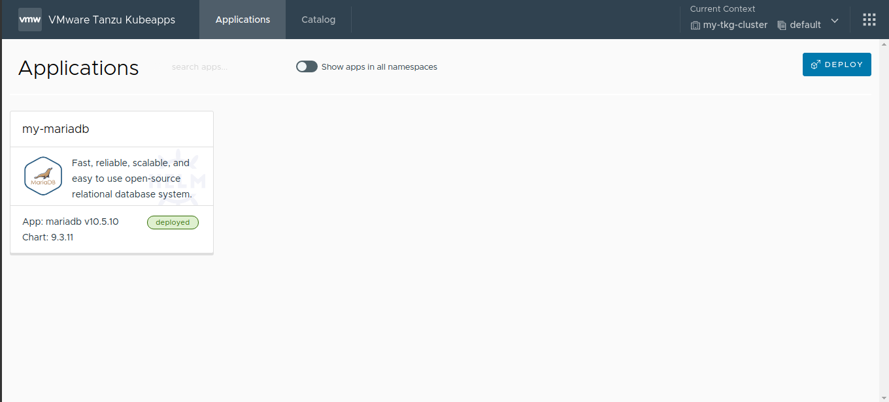
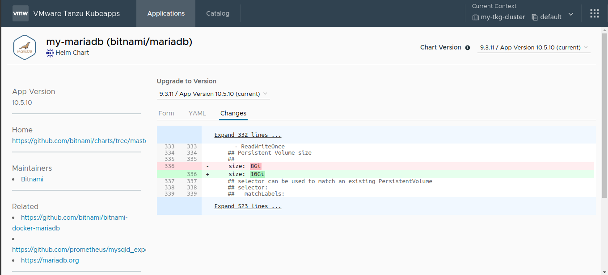
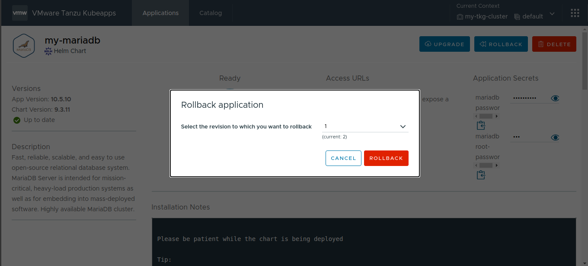
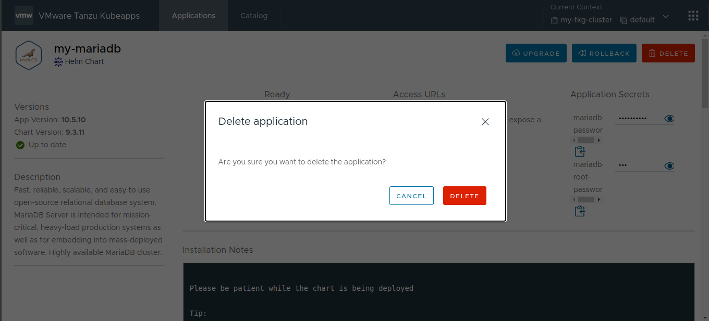

## Step 4: Deploy and Manage Applications with Kubeapps

Once Kubeapps has been configured with one or more application repositories, it can be used to manage and deploy applications in the cluster.

The following sections discuss how to perform common tasks related to application management, including deploying an application, upgrading it, listing available applications. performing rollbacks and deleting applications.

### Deploy a New Application

To deploy a new application, follow the steps below:

1. Log in to Kubeapps to arrive at the dashboard welcome page:

   

2. Use the _Catalog_ menu to search for the desired application, for instance, _MariaDB_:

   

3. Click on the application to see the details:

   

4. Click on the _Deploy_ button. You will be prompted for the release name, cluster namespace and the values for your application deployment.

   

5. Click the _Deploy_ button at the end of the page. Wait a while until it gets deployed.

   

The application is deployed. The status of the deployment can be tracked directly from the browser. The _Notes_ section of the deployment page contains important information to help you use the application.

### List All Applications

The _Applications_ page displays a list of the application deployments in your cluster.

### Upgrade an Application

To upgrade an application with new values, follow the steps below:

1. Navigate to the _Applications_ page.
2. Click the application you wish to upgrade.

   

3. Click the _Upgrade_ button.

   

4. Perform the changes and click the _Changes_ tab to see the differences with the installed version.

   

5. Click the _Deploy_ button.

The application is upgraded with the new values. The status of the deployment can be tracked directly from the browser.

### Rollback an Application

To rollback an application to a previous version, follow the steps below:

1. Navigate to the _Applications_ page.
2. Click the application you wish to upgrade.

   

3. Click the _Rollback_ button.

   

4. Select the version to rollback to and confirm the operation by clicking the _Rollback_ button in the confirmation dialog.

   

The application is rolled back to the desired version. The status of the deployment can be tracked directly from the browser.

### Delete an Application

Running applications can be removed from the cluster by clicking the _Delete_ button on the application's status page:

At the end of this step, you should be able to use Kubeapps for common application management and deployment tasks. Continue reading for a collection of [useful links and references to help you maximize your usage of Kubeapps](./conclusion.md).
