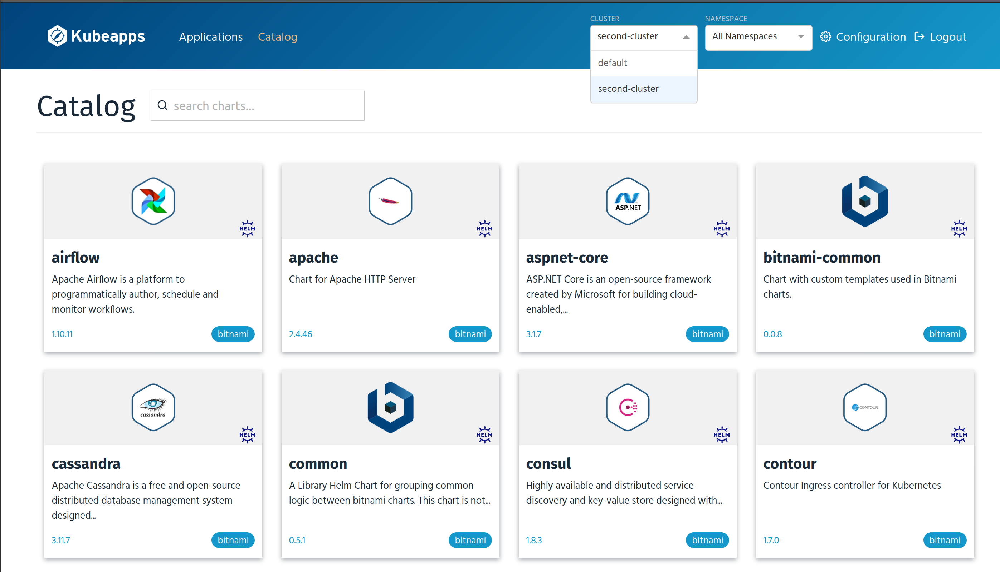
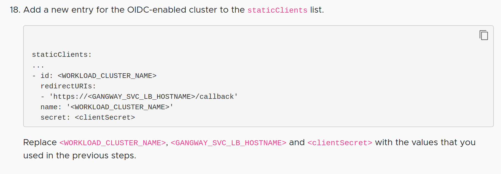

# Configuring Kubeapps for multiple clusters

It is now possible to configure Kubeapps to target other clusters when deploying a chart, in addition to the cluster on which Kubeapps is itself deployed.

Once configured, you can select the cluster to which you are deploying in the same way that you can already select the namespace to which you are deploying:



When you have selected the target cluster and namespace, you can browse the catalog as normal and deploy apps to the chosen target cluster and namespace as you would normally.

You can watch a brief demonstration of deploying to an additional cluster (we will update this demo in a few weeks with the new UI):

[](https://www.youtube.com/watch?v=KIoW4zZDtdY)

## Requirements

To use the multi-cluster support in Kubeapps, you must first setup your clusters to use the OIDC authentication plugin configured with a chosen OIDC/OAuth2 provider. This setup depends on various choices that you make and is out of the scope of this document, but some specific points are mentioned below to help with the setup.

### Configuring your Kubernetes API servers for OIDC

The multi-cluster feature requires that each of your Kubernetes API servers trusts the same OpenID Connect provider, whether that be a specific commercial OAuth2 provider such as Google, Azure or Github, or an instance of [Dex](https://github.com/dexidp/dex/blob/master/Documentation/kubernetes.md). After you have selected your OIDC provider you will need to configure at least one OAuth2 client to use. For example, if you are using Dex, you could use the following Dex configuration to create a single client id which can be used by your API servers:

```yaml
  staticClients:
  - id: kubeapps
    redirectURIs:
    - 'https://localhost/oauth2/callback'
    name: 'Kubeapps-Cluster'
    secret: ABcdefGHIjklmnoPQRStuvw0
```

The Kubernetes documentation has more information about [configuring your Kubernetes API server to trust an OIDC provider](https://kubernetes.io/docs/reference/access-authn-authz/authentication/#configuring-the-api-server). For more information about running Kubeapps with various OIDC providers see [Using an OIDC provider](/docs/user/using-an-OIDC-provider.md).

Certain multi-cluster environments, such as Tanzu Kubernetes Grid, have specific instructions for configuring their workload clusters to trust an instance of Dex. See the [Deploying an Authentication-Enabled Cluster](https://docs.vmware.com/en/VMware-Tanzu-Kubernetes-Grid/1.0/vmware-tanzu-kubernetes-grid-10/GUID-manage-instance-deploy-oidc-cluster.html) in the TKG documentation for an example. For a multi-cluster Kubeapps setup on TKG you will also need to configure [Kubeapps and Dex to support the different client-ids used by each cluster](#clusters-with-different-client-ids).

If you are testing the multi-cluster support on a local [Kubernetes-in-Docker cluster](https://kind.sigs.k8s.io/), you can view the example configuration files used for configuring two kind clusters in a local development environment:

* [Kubeapps cluster API server config](/docs/user/manifests/kubeapps-local-dev-apiserver-config.yaml)
* An [additional cluster API server config](/docs/user/manifests/kubeapps-local-dev-additional-apiserver-config.yaml)

These are used with an instance of Dex running in the Kubeapps cluster with a [matching configuration](/docs/user/manifests/kubeapps-local-dev-dex-values.yaml) and Kubeapps itself [configured with its own auth-proxy](/docs/user/manifests/kubeapps-local-dev-auth-proxy-values.yaml).

## A Kubeapps Configuration example

Once you have the cluster configuration for OIDC authentication sorted, we then need to ensure that Kubeapps is aware of the different clusters to which it can deploy applications.

The `clusters` option available in the Kubeapps' chart `values.yaml` is a list of yaml maps, each defining at least the name and api service URL of a cluster. For example:

```yaml
clusters:
 - name: team-sandbox
   apiServiceURL: https://172.18.0.3:6443
   certificateAuthorityData: aou...
   serviceToken: hrnf...
 - name: customer-a
   apiServiceURL: https://customer-a.example.com
   serviceToken: ...
```

The `name` and `apiServiceURL` are the only required items for each cluster. Note that the apiServiceURL can be a public or internal URL, the only restrictions being that:

* the URL is reachable from the pods of the Kubeapps installation.
* the URL uses TLS (https protocol)

If a private URL is used, as per the first cluster above (`team-sandbox`) you will need to additionally include the base64-encoded `certificateAuthorityData` for the cluster. You can get this directly from the kube config file with:

```bash
kubectl --kubeconfig ~/.kube/path-to-kube-confnig-file config view --raw -o jsonpath='{.clusters[0].cluster.certificate-authority-data}'
```

Alternatively, for a development with private API server URLs, you can omit the `certificateAuthorityData` and instead include the field `insecure: true` for a cluster and Kubeapps will not try to verify the secure connection.

A serviceToken is not required but provides a better user experience, enabling users viewing the cluster to see the namespaces to which they have access (only) when they use the namespace selector. The service token should be configured with RBAC so that it can only list namespaces on the cluster. You can refer to the [example used for a local development environment](/docs/user/manifests/kubeapps-local-dev-namespace-discovery-rbac.yaml).

Your Kubeapps installation will also need to be [configured to use OIDC for authentication](/docs/user/using-an-OIDC-provider.md) with a client-id for your chosen provider.

## Clusters with different client-ids

Some multi-cluster environments configure each cluster's API server with its own client-id for the chosen OAuth2 provider. For example, part of the [configuration of an OIDC-enabled workload cluster in TKG](https://docs.vmware.com/en/VMware-Tanzu-Kubernetes-Grid/1.0/vmware-tanzu-kubernetes-grid-10/GUID-manage-instance-gangway-aws.html) has you creating a separate client ID for the new cluster:



In this case, there is some extra configuration required to ensure the OIDC token used by Kubeapps is accepted by the different clusters.

### Configuring the OIDC Provider to trust peer client ids

First your OIDC Provider needs to be configured so that tokens issued for the client-id with which Kubeapps' auth-proxy is configured are allowed to include the client-ids used by the other clusters in the [audience field of the `id_token`](https://openid.net/specs/openid-connect-core-1_0.html#IDToken). When using Dex, this is done by ensuring each additional client-id trusts the client-id used by Kubeapps' auth-proxy. For example, you can view the [local development configuration of Dex](/docs/user/manifests/kubeapps-local-dev-dex-values.yaml) and see that both the `second-cluster` and `third-cluster` client-ids list the `default` client-id as a trusted peer.

### Configuring the auth-proxy to request multiple audiences

The second part of the additional configuration is to ensure that when Kubeapps' auth-proxy requests a token that it includes extra scopes, such as `audience:server:client_id:second-cluster` for each additional audience that it requires in the issued token. For example, you can view the [auth-proxy configuration used in the local development environment](/docs/user/manifests/kubeapps-local-dev-auth-proxy-values.yaml) and see the additional scopes included there to ensure that the `second-cluster` and `third-cluster` are included in the audience of the resulting token.

## Updating multicluster options

TBD

## Limitations

The following limitations exist when configuring Kubeapps with multiple clusters:

* The configured clusters must all trust the same OIDC/OAuth2 provider.
* The OIDC/OAuth2 provider must use TLS (https protocol).
* The APIServers of each configured cluster must be routable from the pods of the Kubeapps installation.
* Only AppRepositories installed for all namespaces (ie. AppRepositories in the same namespace as the Kubeapps installation) will be available in the catalog when targeting other clusters. There is no support for private AppRepositories on other clusters.
* Similarly, the Operator support (currently behind a feature-flag) is only available on the installation cluster.
