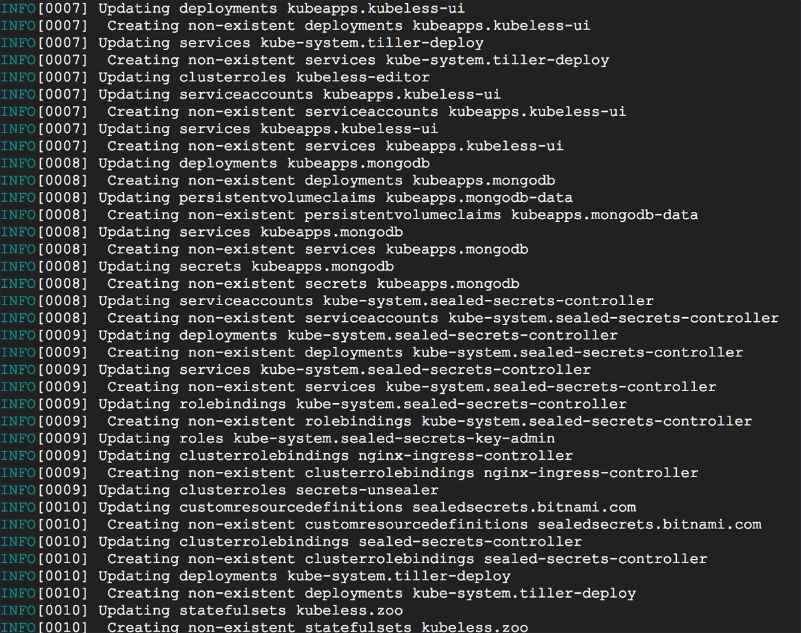
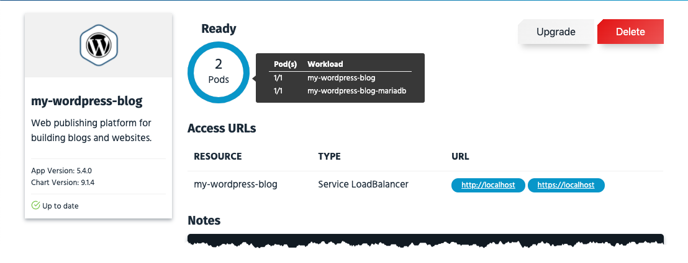

# Get Started with Kubeapps

This guide will walk you through the process of deploying Kubeapps for your cluster and installing an example application.

## Prerequisites

Kubeapps assumes a working Kubernetes cluster (v1.8+) and [`kubectl`](https://kubernetes.io/docs/tasks/tools/install-kubectl/) installed and configured to talk to your Kubernetes cluster. Kubeapps binaries are available for Linux, OS X and Windows, and Kubeapps has been tested with Azure Kubernetes Service (AKS), Google Kubernetes Engine (GKE), `minikube` and Docker for Desktop Kubernetes. Kubeapps works on RBAC-enabled clusters and this configuration is encouraged for a more secure install.

## Step 1: Install Kubeapps

To install Kubeapps, download the latest Kubeapps Installer binary for your platform from the [release page](https://github.com/kubeapps/kubeapps/releases).

Review our [installation guide](./install.md) for more detailed instructions.

Once the Kubeapps Installer is installed, deploy Kubeapps in your cluster with this command:

```
kubeapps up
```

You should see something like this as Kubeapps is deployed:



If you would like to see what exactly `kubeapps up` is installing on your system, we provide `--dry-run` option to show you the Kubeapps manifest as below:

```
kubeapps up --dry-run -o yaml

# prefer json format
kubeapps up --dry-run -o json
```

To remove Kubeapps from your cluster, run this command:

```
kubeapps down
```

## Step 2: Create a Kubernetes API token

Access to the dashboard requires a Kubernetes API token to authenticate with the Kubernetes API server.

```
kubectl create serviceaccount kubeapps-operator
kubectl create clusterrolebinding kubeapps-operator --clusterrole=cluster-admin --serviceaccount=default:kubeapps-operator
kubectl get secret $(kubectl get serviceaccount kubeapps-operator -o jsonpath='{.secrets[].name}') -o jsonpath='{.data.token}' | base64 --decode
```

NOTE: It's not recommended to create `cluster-admin` users for Kubeapps. Please refer to the [Access Control](/docs/user/access-control.md) documentation to configure fine-grained access control for users.

## Step 3: Start the Kubeapps Dashboard

Once Kubeapps is installed, securely access the Kubeapps Dashboard from your system by running:

```
kubeapps dashboard
```

This will start an HTTP proxy for secure access to the Kubeapps Dashboard and launch your default browser to access it. Here's what you should see:


Paste the token generated in the previous step to authenticate and access the Kubeapps dashboard for Kubernetes.


## Step 4: Deploy WordPress

Once you have the Kubeapps Dashboard up and running, you can start deploying applications into your cluster.

* Use the "Charts" page in the Dashboard to select an application from the list of charts in the official Kubernetes chart repository. This example assumes you want to deploy WordPress.

  

* Click the "Deploy using Helm" button.

  

* You will be prompted for the release name, cluster namespace and values for the application.

  

* Click the "Submit" button. The application will be deployed. You will be able to track the new Kubernetes deployment directly from the browser.

  

To obtain the WordPress username and password, refer to the "Notes" section of the deployment page, which contains the commands you will need to run to obtain the credentials for the deployment.


## Next Steps

Learn more about Kubeapps with the links below:

* [Detailed installation instructions](install.md)
* [Kubeapps Dashboard documentation](dashboard.md)
* [Kubeapps components](components.md)
