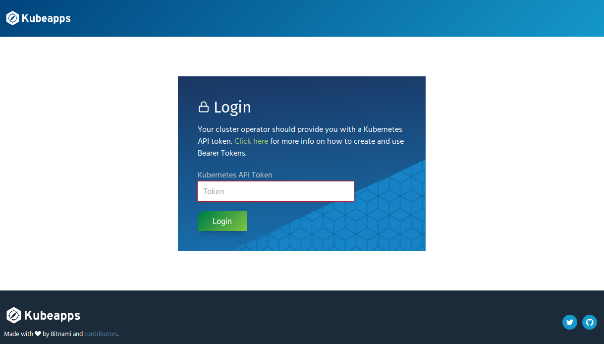

# Kubeapps Login

By default, when first visiting Kubeapps, a login form is shown for the user to introduce a Kubernetes API token:



The goal of the login form is to identify the user and associate it with a Kubernetes service account. This identity information will be used by Kubeapps to authenticate the user against the Kubernetes API. You can find more information about access control in Kubeapps in this [document](./access-control.md).

However, it's possible to disable the form or delegate the authentication to an OIDC provider so users don't need to introduce a token in the login form.

## Bypassing authentication

Kubeapps will skip the login form if it detects that an `Authorization` header is already being set by a reverse-proxy, such as an Ingress. An Ingress object can be configured to inject a hardcoded valid Kubernetes API token on every request to Kubeapps to force the login form to be skipped and enable all API requests to use the hardcoded token.

**NOTE**: This is not recommended in production since anyone with access to Kubeapps would be granted with the permissions associated with the hardcoded token.

This is an example of the values that you can configure in the Kubeapps chart in order to set a valid token:

```yaml
ingress:
  enabled: true
  hosts:
    - name: kubeapps.local
      path: /
      tls: false
  annotations:
    nginx.ingress.kubernetes.io/proxy-read-timeout: "600"
    nginx.ingress.kubernetes.io/configuration-snippet: |
      add_header Authorization "Bearer TOKEN";
```

You just need to substitute TOKEN with the actual value of the token. The above assumes an Nginx [Ingress Controller](https://kubernetes.io/docs/concepts/services-networking/ingress/#ingress-controllers), in case a different controller is being used that annotation will need to be adapted.

# Using an OIDC provider

In case you want to use OpenID Connect to authenticate Kubeapps users, and your Kubernetes API server is configured to use the same OIDC provider, follow this [guide](./using-an-OIDC-provider.md).
